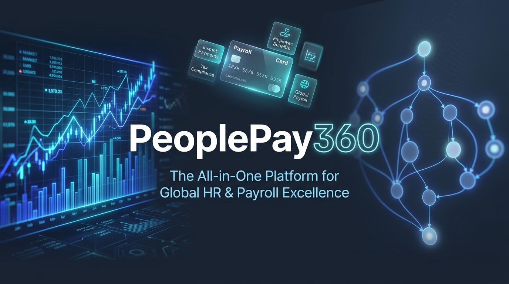

# 🏷️ PeoplePay360

<p align="center">
  
</p>

<p align="center">
  <a href="https://github.com/naveencmy/PeoplePay360/blob/main/LICENSE"></a>
  <a href="https://github.com/naveencmy/PeoplePay360"></a>
  <a href="https://github.com/naveencmy/PeoplePay360/pulls"></a>
  <a href="https://nodejs.org/"></a>
  <a href="https://react.dev/"></a>
  <a href="https://www.postgresql.org/"></a>
  
</p>

An integrated, enterprise-grade Human Resource and Payroll Operations platform that unifies employee lifecycles, period-valid contracts, shift schedules, and attendance into a deterministic, AST-powered salary computation engine. Built for high-volume payroll precision, statutory Indian tax compliance, and zero-compromise data integrity.

---

## 📋 Table of Contents
- [✨ Features](#-features)
- [🛠️ Tech Stack](#%EF%B8%8F-tech-stack)
- [🚀 Getting Started](#-getting-started)
  - [Prerequisites](#prerequisites)
  - [Installation & Environment Setup](#installation--environment-setup)
  - [Database Migration & Real Seeding](#database-migration--real-seeding)
  - [Running the Services](#running-the-services)
- [💡 Usage & Architecture Flow](#-usage--architecture-flow)
- [📂 Project Structure](#-project-structure)
- [🛡️ Enterprise Security & RBAC](#%EF%B8%8F-enterprise-security--rbac)
- [🗺️ Roadmap](#%EF%B8%8F-roadmap)
- [🤝 Contributing](#-contributing)
- [📄 License](#-license)

---

## ✨ Features

* **Centralized Employee Master & Smart Actions** – Unified Directory supporting dense tabular List and interactive departmental Kanban views, equipped with contextual smart buttons that dynamically link to active contracts, attendance, time off quotas, and payslips.
* **Period-Specific Contract Management** – Multi-contract timeline tracking that mathematically guarantees payroll processes only the contract applicable to the active cycle dates, preventing duplicate active salary disbursements.
* **Automated Shift & Weekly Hour Engine** – Interactive 7-day schedule configuration with day-by-day shift intervals, break allocations, and instant automatic weekly hour computation eliminating manual calculation errors.
* **Policy-Driven Time Off & Quota Consumption** – Multi-tier leave management covering statutory paid/unpaid policies and quota allocations with automated atomic deduction upon manager approval.
* **Safe Mathematical DAG Salary Computation** – Evaluates complex multi-variable compensation formulas (Basic, HRA, DA, PF caps, ESI, TDS) using Directed Acyclic Graphs (DAG) and Kahn's Topological Sort with cycle detection—completely eliminating unsafe `eval()`.
* **Idempotent 4-Stage Payrun State Machine** – Formal workflow enforcement (`Draft` $\rightarrow$ `Computed` $\rightarrow$ `Validated` $\rightarrow$ `Paid`), running automated pre-flight integrity scans for missing IFSC codes, zero-wage contracts, or duplicate line items before final disbursement.
* **Statutory Itemized Payslips & Vector Delivery** – Line-by-line earnings and deductions settlement statements with custom printable stylesheets, client-side PDF generation, and asynchronous bulk email dispatch.
* **Zero Mock Data Guarantee** – 100% of all analytics, charts, tables, check-in widgets, and operational alerts are backed by live PostgreSQL queries and real-time state changes.

---

## 🛠️ Tech Stack

### Frontend
* **Core:** React 19, JavaScript (ES2022)
* **Styling & Design System:** Tailwind CSS v3, Vanilla CSS Design Tokens (Dark/Light Modes)
* **Routing & Client State:** React Router v7, Zustand v5 (Persisted Session & Theme Stores)
* **Data Fetching:** TanStack React Query v5 (Optimistic Updates & Query Invalidation)
* **Visualizations & UI:** Recharts, Lucide React, Headless UI, React Hot Toast
* **Tooling:** Vite 5, PostCSS, Autoprefixer

### Backend & Infrastructure
* **Runtime & Framework:** Node.js (LTS), Express 4 (Modular Monolith Architecture)
* **Primary Database:** PostgreSQL 14+ (Connection Pooling via `pg`, Repository Pattern, No ORM Overhead)
* **Identity & Security:** JWT (JSON Web Tokens), bcryptjs, Helmet, CORS, Rate Limiting
* **Mathematical Parser:** `mathjs` AST Parser, Topological Graph Sorter
* **Async Job Queue:** PostgreSQL-backed background workers (`pg-boss` / BullMQ & Redis)
* **PDF & Communication:** PDFKit vector generation, Nodemailer with SMTP integration
* **Testing:** Jest, Supertest (76/76 Unit & Integration Tests Passing)

---

## 🚀 Getting Started

Follow these instructions to run the entire platform locally from scratch.

### Prerequisites
Make sure the following dependencies are installed on your machine:
* **Node.js** >= 18.18.0
* **PostgreSQL** >= 14.0 (running locally on port `5432` or via cloud instance)
* **npm** >= 9.0.0

```bash
node -v
psql --version
```

---

### Installation & Environment Setup

1. **Clone the repository**:
   ```bash
   git clone https://github.com/naveencmy/PeoplePay360.git
   cd PeoplePay360
   ```

2. **Configure Backend Environment**:
   ```bash
   cd backend
   cp .env.example .env
   ```
   *Edit `backend/.env` to configure your PostgreSQL credentials:*
   ```env
   PORT=5000
   NODE_ENV=development
   DB_HOST=localhost
   DB_PORT=5432
   DB_NAME=peoplepay360
   DB_USER=postgres
   DB_PASSWORD=your_postgres_password
   JWT_SECRET=enterprise_super_secret_jwt_key_360
   ```

3. **Install Dependencies**:
   ```bash
   # Install backend dependencies
   npm install

   # Install frontend dependencies
   cd ../frontend
   npm install
   ```

---

### Database Migration & Real Seeding

Create the database and execute the automated schema migrations and production dataset seed:

```bash
# In backend/ directory:
npm run migrate
npm run seed
```

> **Seeded Test Accounts (Password: `demo123` or `Admin@123`):**
> * **Super Admin:** `admin@company.com` (Full system governance)
> * **HR Manager:** `hrmanager@company.com` (Employees, Shifts, Time Off)
> * **Payroll Manager:** `payroll@company.com` (Payruns, Payslips, Salary Rules)
> * **Payroll Officer:** `payrolluser@company.com` (Operational payrun batches)
> * **Employee:** `employee@company.com` (Self-service portal & check-in)

---

### Running the Services

Launch both backend and frontend servers:

```bash
# Terminal 1: Backend API (Port 5000)
cd backend
npm run dev

# Terminal 2: Frontend Web App (Port 3000)
cd frontend
npm run dev
```

Open [http://localhost:3000](http://localhost:3000) in your browser to access PeoplePay360.

---

## 💡 Usage & Architecture Flow

### Safe Algebraic Formula Evaluation

PeoplePay360 executes salary rules dynamically through an isolated AST parser, resolving dependencies in strict topological sequence:

```javascript
import { evaluateRuleTree, buildDependencyDAG } from './services/computation.service.js';

// Define salary rules with algebraic cross-dependencies
const rules = [
  { code: 'BASIC', computation_type: 'PERCENTAGE', computation_basis: 'WAGE', amount: 0.40 },
  { code: 'HRA', computation_type: 'PERCENTAGE', computation_basis: 'BASIC', amount: 0.50 },
  { code: 'GROSS', computation_type: 'FORMULA', formula: 'BASIC + HRA + SPECIAL_ALLOWANCE' },
  { code: 'PF', computation_type: 'FORMULA', formula: 'min(BASIC * 0.12, 1800)' },
  { code: 'NET', computation_type: 'FORMULA', formula: 'GROSS - (PF + PT + TDS)' }
];

// Evaluates DAG order, detects cycles, and calculates accurate line items
const result = await evaluateRuleTree({
  rules,
  wage: 85000,
  workedDays: 22,
  totalDays: 22
});

console.log(`Computed Net Salary: ₹${result.net.toLocaleString('en-IN')}`);
```

---

## 📂 Project Structure

```text
PeoplePay360/
├── backend/
│   ├── src/
│   │   ├── api/
│   │   │   ├── routes/              # Express route controllers (Auth, Employees, Payruns, Rules)
│   │   │   └── index.js             # API aggregator
│   │   ├── config/                  # Database pool, JWT, Redis, and environment configs
│   │   ├── controllers/             # HTTP request handling and response serialization
│   │   ├── jobs/                    # Asynchronous workers (PDF generation, bulk email delivery)
│   │   ├── middleware/              # Auth guard, RBAC permission matrix, and error handlers
│   │   ├── repositories/            # Raw parameterized PostgreSQL SQL data layers
│   │   ├── scripts/                 # Schema migration and real enterprise dataset seeds
│   │   ├── services/                # Business logic, DAG formula engine, and state machines
│   │   ├── utils/                   # Financial currency formatters and working day math
│   │   └── app.js                   # Express application entrypoint
│   ├── tests/
│   │   └── unit/                    # Unit tests for payrun state machine & formula compiler
│   ├── package.json
│   └── .env.example
├── frontend/
│   ├── public/                      # Static brand assets, favicon, and logos
│   ├── src/
│   │   ├── api/                     # Real Axios clients with token refresh interceptors
│   │   ├── assets/                  # High-resolution branding and vector graphics
│   │   ├── components/
│   │   │   ├── admin/               # User creation and RBAC governance slide-overs
│   │   │   ├── employee/            # Kanban boards, directory cards, and creation modals
│   │   │   ├── layout/              # AppShell, TopBar, Navigation, and Breadcrumbs
│   │   │   ├── payrun/              # Two-step payrun creation wizard and batch tables
│   │   │   ├── salary/              # DAG rule visualizer and algebraic formula forms
│   │   │   ├── timeoff/             # Quota allocation and leave request modals
│   │   │   └── ui/                  # Reusable Button, Card, Table, Modal, and Logo components
│   │   ├── hooks/                   # React Query custom hooks for all data entities
│   │   ├── pages/                   # Application views (Dashboard, Employees, Payruns, Payslips)
│   │   ├── store/                   # Zustand authentication and theme stores
│   │   ├── App.jsx                  # Route definitions and access guards
│   │   └── main.jsx                 # Client entrypoint
│   ├── jsconfig.json                # Bundler module resolution and path aliasing
│   ├── vite.config.js               # Vite bundler & reverse proxy setup
│   └── package.json
├── docs/
│   └── assets/                      # Hero banners and architectural diagrams
├── CONTRIBUTING.md                  # Comprehensive engineering & contribution guidelines
├── CONTRIBUTOR.md                   # Contributor reference
├── LICENSE                          # Apache License, Version 2.0
└── README.md                        # Enterprise documentation
```

---

## 🛡️ Enterprise Security & RBAC

PeoplePay360 enforces a defense-in-depth permission matrix across all routes and API endpoints:

| Role | Employee Master | Contracts | Shifts & Attendance | Time Off | Payroll Processing | Salary Rules | System Admin |
| :--- | :---: | :---: | :---: | :---: | :---: | :---: | :---: |
| **Employee** | Read Own | Read Own | Self Check-In | Request / Balances | Read Own Payslip | ❌ No Access | ❌ No Access |
| **HR Manager** | Full CRUD | Full CRUD | Full CRUD | Approve / Refuse | ❌ No Access | ❌ No Access | ❌ No Access |
| **HR Payroll User** | Full CRUD | Full CRUD | Full CRUD | Approve / Refuse | Create / Read / Update | Read Only | ❌ No Access |
| **HR Payroll Manager**| Full CRUD | Full CRUD | Full CRUD | Full Control | Full Processing | Full CRUD | ❌ No Access |
| **Admin** | Full Control | Full Control | Full Control | Full Control | Full Control | Full Control | Full Control |

---

## 🗺️ Roadmap

- [x] Phase 1: Core Employee Master, Contracts, and Shift Schedule setup.
- [x] Phase 2: Directed Acyclic Graph (DAG) Salary Rule engine with cycle validation.
- [x] Phase 3: Two-step Payrun wizard, batch processing, and pre-flight anomaly scans.
- [x] Phase 4: Atomic Time Off allocation management and automated leave deduction.
- [x] Phase 5: High-fidelity statutory payslip generation with client print & bulk email dispatch.
- [x] Phase 6: Enterprise dark/light redesign, zero mock data migration, and full test suite.
- [ ] Phase 7: Real-time WebSocket notifications for payrun milestone completions.
- [ ] Phase 8: Multi-currency global payroll payout gateways (Stripe Connect / Wise API).

---

## 🤝 Contributing

Contributions are what make the open-source community an exceptional place to learn, inspire, and innovate. Please read our detailed [**CONTRIBUTING.md**](./CONTRIBUTING.md) guide before opening a pull request.

1. Fork the Project
2. Create your Feature Branch (`git checkout -b feature/AmazingFeature`)
3. Commit your Changes with Conventional Commits (`git commit -m 'feat(payroll): add tax bracket simulation'`)
4. Push to the Branch (`git push origin feature/AmazingFeature`)
5. Open a Pull Request

---

## 📄 License

Distributed under the **Apache License, Version 2.0**. See [`LICENSE`](./LICENSE) for more information.
